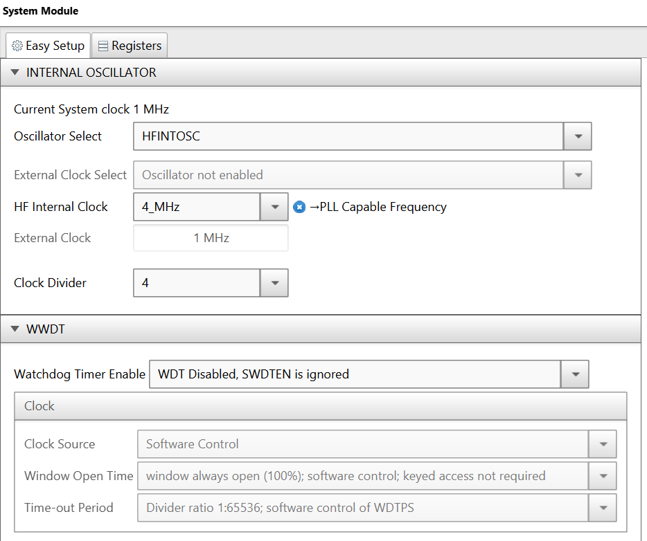
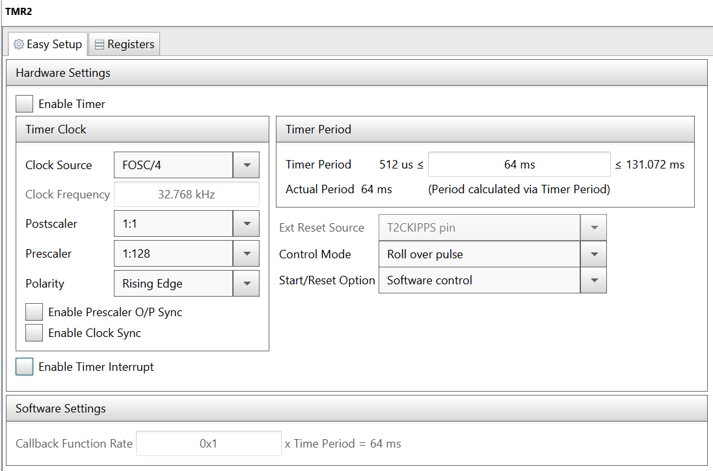
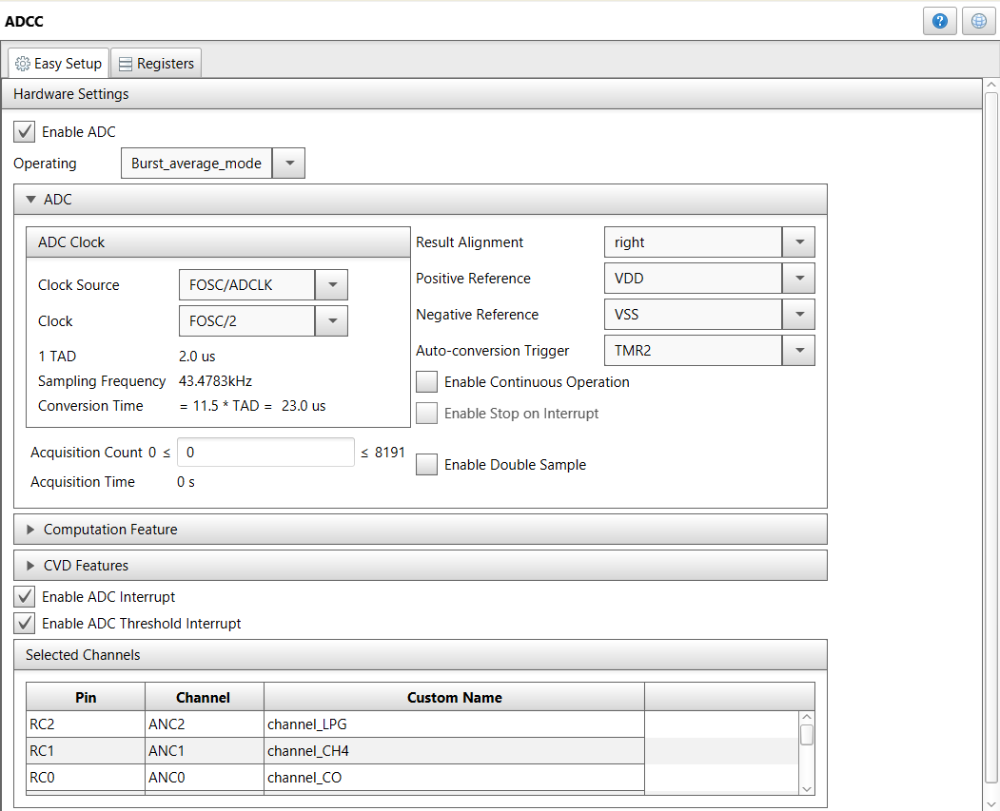
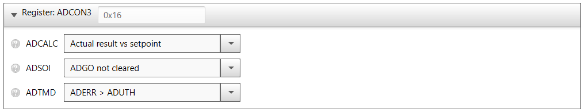
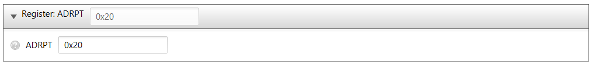
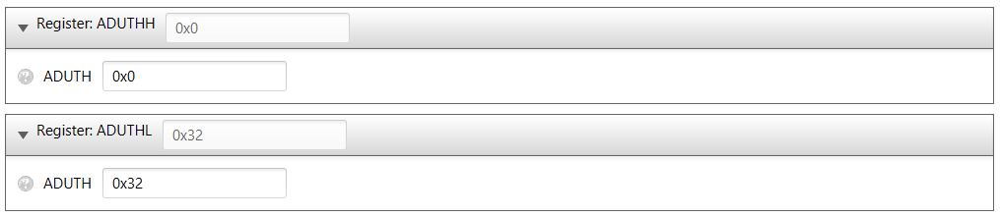
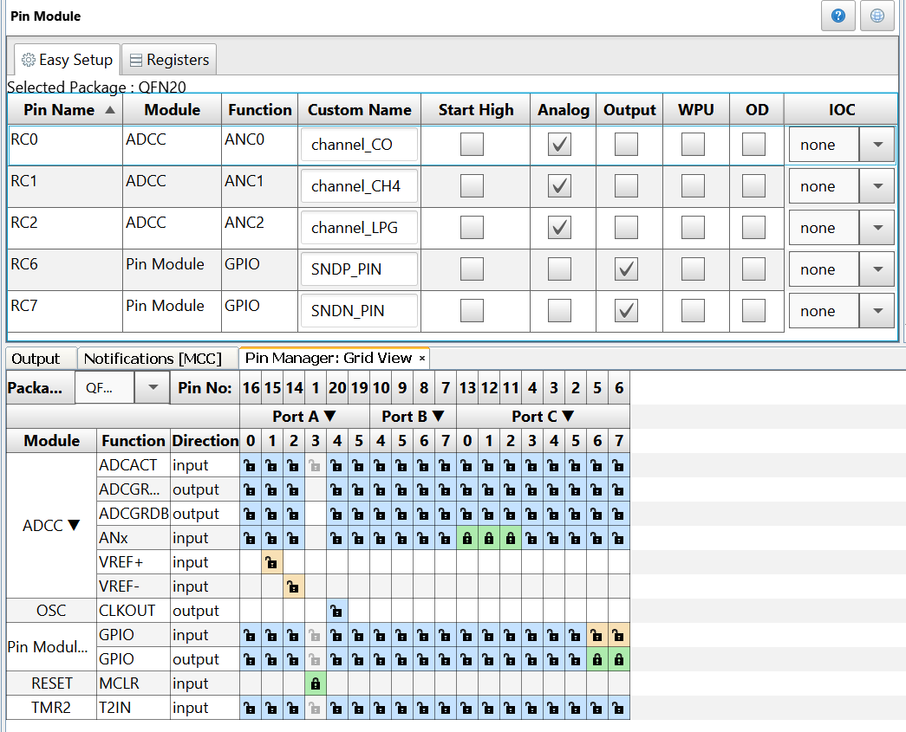

# Gas Leak Detector Using ADCC

The Analog-to-Digital Converter with Computation (ADCC) of the PIC16F18446 is used to read 3 gas sensors. The ADCC conversion is automatically started by Timer 2 (TMR2) overflow. When the conversion is completed, the ADCC generates an interrupt. It also computes the difference between the sensor reading and a configured setpoint, and generates an interrupt if that difference exceeds a specified threshold value. 

## Related Documentation
- [PIC16F18446 Product Family Page](https://www.microchip.com/design-centers/8-bit/pic-mcus/device-selection/pic16f18446)
- [PIC16F18446 datasheet](http://ww1.microchip.com/downloads/en/DeviceDoc/40001985B.pdf) for more information or specifications.

## Software Used

- MPLAB® X IDE 5.30 or newer [(microchip.com/mplab/mplab-x-ide)](http://www.microchip.com/mplab/mplab-x-ide)
- MPLAB® XC8 2.10 or newer compiler [(microchip.com/mplab/compilers)](http://www.microchip.com/mplab/compilers)
- MPLAB® Code Configurator (MCC) 3.95.0 or newer [(microchip.com/mplab/mplab-code-configurator)](https://www.microchip.com/mplab/mplab-code-configurator)
- MPLAB® Code Configurator (MCC) PIC10/PIC12/PIC16/PIC18 library v1.79.0 or newer [(microchip.com/mplab/mplab-code-configurator)](https://www.microchip.com/mplab/mplab-code-configurator)

## Hardware Used

- PIC16F18446 Curiosity Nano [DM164144](https://www.microchip.com/Developmenttools/ProductDetails/DM164144)
- Curiosity Nano Base for Click boards™ [AC164162](https://www.microchip.com/developmenttools/ProductDetails/AC164162)
- MikroElektronika CO click™ [MIKROE-1626](https://www.mikroe.com/co-click)
- MikroElektronika Methane click™ [MIKROE-1628](https://www.mikroe.com/methane-click)
- MikroElektronika LPG click™ [MIKROE-1587](https://www.mikroe.com/lpg-click)
- Buzzer

## Setup

The PIC uses the Burst Average mode of the ADCC to read the 3 sensors at power on, and then it uses those 3 values as setpoints. The alarm will sound if a sensor reading exceeds its setpoint by a specified value, which is written in the ADUTHL register. For an increased accuracy, the gas sensors require up to 48h of heating time, so the user can leave the circuit powered for that period, and then reset the setpoints by resetting the power.

The MCU uses the high frequency internal oscilator (HFINTOSC), and the clock is set to 1 MHz. Watchdog Timer is not used in this demo, so it is disabled. 
MCC configurations, Internal Oscillator and WWDT:

- Oscillator Select: HFINTOSC
- HF Internal Clock: 4_MHz
- Clock Divider: 4
- Watchdog Timer Enable: WDT Disabled, SWDTEN is ignored.

The settings are presented in the figure below.

 

Timer 2 is configured to overflow every 64 milliseconds. It triggers the start of the ADCC conversion. 
MCC configurations for TMR2:

- Clock Source: FOSC/4
- Postscaler: 1:1
- Prescaler: 1:128
- Polarity: Rising Edge
- Timer Period: 64ms
- Control Mode: Roll over pulse
- Start/Reset Option: Software control

The settings are presented in the figure below.

 

ADCC is used to read the gas sensors. It is configured to operate in burst average mode, to read the first sensor data that will be used as setpoint. Then the code switches the ADCC to basic mode. The ADCC uses FOSC/2 as clock source, and the conversion is triggered by TMR2. 
MCC configurations for ADCC - Easy Setup:

- Enable ADC: checked
- Operating: Burst_average_mode
- Clock Source: FOSC/ADCLK
- Clock: FOSC/2
- Auto-conversion Trigger: TMR2
- Enable ADC Interrupt: checked
- Enable ADC Threshold Interrupt: checked

The settings are presented in the figure below.

 

The computation feature is configured in the ADCON3 register to calculate the difference between the actual result and a setpoint and compare the error with the upper threshold. 
MCC configurations for ADC - Registers:

- ADCALC: Actual result vs setpoint
- ADTMD: ADERR > ADUTH
- ADUTHL - ADUTH: 0x32

The number of samples to acuqire for the burst average mode is set in the ADRPT register. 

- ADRPT: 0x20

The configurated ADCC registers are presented in the figures below.

 
 
 

The pins are configured as follows:

- ANC0 is the analog input for the CO Sensor
- ANC1 is the analog input for the CH4 Sensor
- ANC2 is the analog input for the LPG Sensor
- RC6 and RC7 are configured as GPIO outputs for the piezoelectric buzzer. 

The settings are presented in the figure below. 

 

The prototype demo is presented in the picture below.

 

## Demo

1. After making the above hardware connections, connect the PIC16F18446 CURIOSITY NANO board to PC using the USB cable.
2. Build demo firmware and load the generated hex file onto the PIC16F18446 MCU, by dragging the file to the CURIOSITY drive which appears in the file manager when you connect the board to the USB.
3. When the demo firmware is loaded, the buzzer may beep for a few seconds while the sensors are heating up.
4. When the beep stops, the device is ready for detecting gas.
5. Blow some gas on the sensors and the buzzer will start beeping.

## Conclusion

This example shows how easy it is to use the PIC16F18446 with ADCC and MCC to build a gas leak detector. It shows off the ADCC features like Autotrigger, Burst Average acquisition and Threshold Interrupt.

